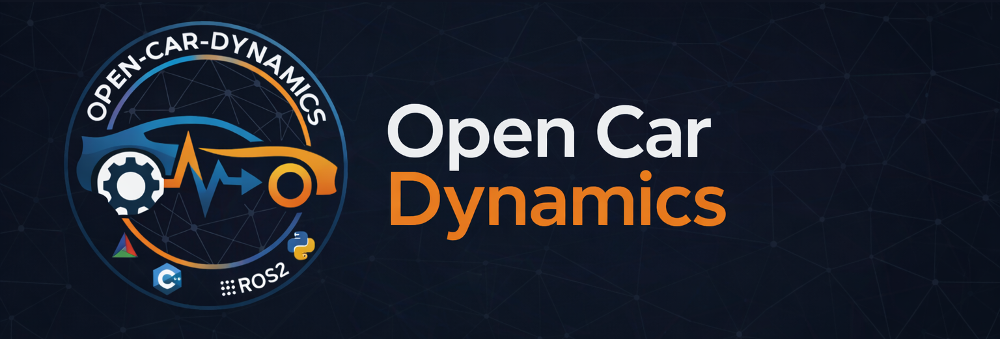
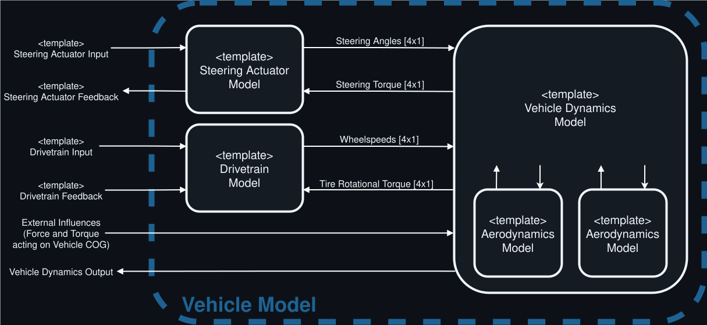

<div align="center">
    
</div>

<div align="center" style="margin-bottom: 30px;">
<p>
The Open Car Dynamics library aims to provide a comprehensive, simple, and easy-to-use implementation of a vehicle's dynamic behavior.
The project's primary focus is to enable closed-loop simulation of trajectory following controllers in autonomous driving.
Considering this goal, the core philosophy behind this implementation is to model the vehicle's behavior in as much detail as necessary but as simply as possible. Keeping the model concise and relatively simple drastically simplifies parametrization and reduces the effort of adapting the model to one's requirements.
</p>
</div>

<div align="center" style="margin-bottom: 30px;">

[](https://isocpp.org/)
[](https://cmake.org/)
[](https://www.docker.com/)
[](https://www.apache.org/licenses/LICENSE-2.0)
[](https://doi.org/10.1109/IV55156.2024.10588858)
<br>

[](https://www.python.org/)
[](https://docs.ros.org/en/humble/)

</div>


--- 

The model is designed to be an ordinary differential equation in state-space formulation. We use the Dormand Prince Scheme with a constant integration step size to solve the differential equation and to enable real-time execution.

To further simplify integration into different control-related simulation architectures, we implemented the model in C++, intending to provide a Python and Matlab binding in the following months.
An [Autoware](https://autoware.org/) compatible ROS2 Node is offered additionally, but the **model itself is entirely independent of ROS2**.

The model has been validated with data recorded with the AV21 autonomous racecar used in the [Indy Autonomous Challenge](https://www.indyautonomouschallenge.com/).

## Overview

The current version of the model combines different models to accurately reproduce the dynamic behavior of an autonomous vehicle:
- Vehicle Dynamics
- Drivetrain
- Steering Actuator
- Aerodynamics
- Communication Delays

The interfaces connecting the different models, are shown in the following figure:



The ROS2 Node running the abovementioned model subscribes and publishes the following topics:


## Compiling and Running the Model

First clone the repository using the command:

```
git clone --recursive https://github.com/TUMFTM/Open-Car-Dynamics.git
```

### Having a ROS2 installed
 
If you have an existing ROS2 installation you can just build the project using colcon, in the repository root:
```
colcon build --packages-up-to vehicle_model_nodes
```

After building the source code, the node can be started with the ros2 run command:
```
source ./install/setup.bash && ros2 run vehicle_model_nodes vehicle_model_double_track_cpp_node --ros-args --params-file ./config/example_config.yml
```

### Only having Docker installed

However, if you don't have an existing ROS2 installation, we provide a Dockerfile in order to build and run the model within a docker container. This is also useful for debugging if problems arise when debugging locally.
To build the needed docker image just run the bash script:
```
bash build_container.sh
```

After the container has been built, the ros2 node running the provided model can be started inside the container using the provided script:
```
bash run_in_container.sh
```
To stop the container:
```
bash stop_container.sh
```

## Parameters

All vehicle parameters can be adapted via the config file `./config/example_config.yml`.
Furthermore, most of the parameters are adaptable at runtime via the `ros2 param set` command.

Unfortunately, significant parts of the parametrization resembling the AV21 racecar are confidential.
Therefore, we can only provide a parametrization that resembles a generic single-seater race car equipped with a conventional on-road tire.


## Related Projects

When building this vehicle model, we initially took inspiration from the [CommonRoad Vehicle Models](https://gitlab.lrz.de/tum-cps/commonroad-vehicle-models) Project. 
However, we needed a real-time capable, modularized model for an autonomous race-car which is why this project was started.


## References

If you use Open Car Dynamics in your work please consider citing our paper [Analyzing the Impact of Simulation Fidelity on the Evaluation of Autonomous Driving Motion Control](https://ieeexplore.ieee.org/document/10588858/).
```
@INPROCEEDINGS{10588858,
  author={Sagmeister, Simon and Kounatidis, Panagiotis and Goblirsch, Sven and Lienkamp, Markus},
  booktitle={2024 IEEE Intelligent Vehicles Symposium (IV)}, 
  title={Analyzing the Impact of Simulation Fidelity on the Evaluation of Autonomous Driving Motion Control}, 
  year={2024},
  volume={},
  number={},
  pages={230-237},
  keywords={Measurement;Analytical models;Heuristic algorithms;Software algorithms;Approximation algorithms;Data models;Vehicle dynamics},
  doi={10.1109/IV55156.2024.10588858}}

```

### Core Developers
 - [Simon Sagmeister](mailto:simon.sagmeister@tum.de)
 - Simon Hoffmann | Implementation of parts of the ROS2 and some of the dependency functions
 - Georg Jank | Implementation of parts of the template structure of this repo.

### Acknowledgments

Several students contributed to the success of the project during their Bachelor's, Master's or Project Thesis.
 - Panagiotis Kounatidis | *Development of an initial version of this model as well as implementation of the tire model.*


Special thanks to my colleagues for the regular technical feedback and talks during the development phase of this model:
- Sven Goblirsch
- Frederik Werner


We gratefully acknowledge financial support by:
 - Deutsche Forschungsgemeinschaft (DFG, German Research Foundation) | Project Number - 469341384

