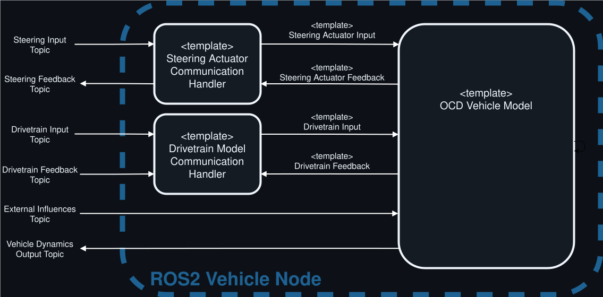

# Using OCD in ROS2

To use Open Car Dynamics Models in ROS 2, we provide a generic
wrapper node which wraps any vehicle model. 
Since the models differ in driver input and feedback types, we use a strategy pattern
to create the subscriptions and feedback publishing. 

These are called Strategies are named CommunicationHandlers.

They connect the Open Car Dynamics Models with the corresponding topics in ROS2.

    

